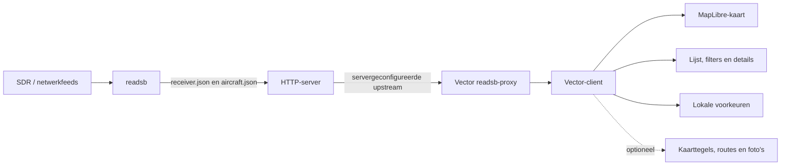

# Architectuur — Vector ADS-B Radar

Status: huidige implementatie en groeirichting
Datum: 24 augustus 2026

## Doel

Vector is een zelfstandig draaiende webinterface boven op readsb/tar1090. readsb blijft verantwoordelijk voor ontvangst, decoding en het publiceren van JSON-data. Vector verzorgt kaartweergave, zoeken, filtering, selectie, details en gebruikersvoorkeuren.

Belangrijke uitgangspunten:

- lokaal te draaien naast een bestaande readsb-installatie;
- geen eigen database; een kleine Node-serverruntime verzorgt configuratie en proxying;
- configuratie zonder broncodewijziging;
- bruikbaar met onvolledige of tijdelijk verouderde receiverdata;
- online kaart-, route- en fotobronnen zijn toegestaan;
- vloeiende kaartinteractie bij periodieke readsb-updates.

## Huidige stack

| Onderdeel | Implementatie |
|---|---|
| Applicatie | React 19 + TypeScript |
| Runtime/build | Vinext op Vite, als standalone Node-server |
| Kaart | MapLibre GL JS |
| Databron | readsb JSON via servergeconfigureerde, begrensde proxy |
| Styling | globale CSS met responsive layout en CSS-variabelen |
| Voorkeuren | browseropslag voor eenheden en labelinstellingen |

## Systeemcontext



De frontend behandelt de readsb-databron als een externe systeemgrens. Ruwe velden worden eerst genormaliseerd voordat kaart en interface ze gebruiken.

## Bronstructuur

```text
app/
  api/config/            publieke runtimeconfiguratie zonder upstream-URLs
  api/readsb/            begrensde proxy voor receiverdata
  globals.css            designsysteem en responsieve layout
  page.tsx               applicatiecompositie en UI-state
public/
  config.json            veilige fallback voor previews zonder serverconfiguratie
  map-style.json         MapLibre-kaartstijl
  data/                   lokale voorbeelddata
src/
  components/            detailcomponenten voor foto en route
  data/                  readsb-, foto- en route-adapters
  domain/                genormaliseerde vliegtuigmodellen
  map/                   kaart, iconen, heading en hoogtekleuren
  server/                externe configuratie en proxyvalidatie
  units.ts               conversie en formattering
scripts/
  install-debian.sh      herhaalbare Debian 13-installatie en updates
  sync-tar1090-icons.mjs  reproduceerbare iconsynchronisatie
packaging/
  systemd/               service-unit
  vector.env.example     lokale configuratiesjabloon
```

## Datastroom

```mermaid
flowchart TD
    C[/api/config] --> F[Aircraft feed]
    F --> P[/api/readsb met relatieve resourcepaden]
    E[/etc/vector/vector.env] --> C
    E --> P
    P --> N[Normalisatie]
    N --> S[React state]
    S --> L[Vliegtuiglijst]
    S --> D[Detailpaneel]
    S --> M[MapLibre markers]
    M --> T[Leg trace geselecteerd toestel]
```

De feed pollt de bestaande `aircraft.json`-snapshot. Posities worden bij een nieuwe geldige GPS-fix direct bijgewerkt. Een kleine stationary-noise filter voorkomt zichtbare GPS-jitter zonder het toestel kunstmatig tussen oude en nieuwe posities te laten schuiven.

## Domeinmodel

`src/domain/aircraft.ts` bevat het interne vliegtuigmodel. De data-adapter vangt alternatieve en ontbrekende readsb-velden af. Presentatiecomponenten werken hierdoor niet rechtstreeks met onbetrouwbare wire-data.

Het model bewaart bronwaarden die geschikt zijn voor conversie. `src/units.ts` formatteert deze voor drie systemen:

- `metric`: meter, kilometer per uur en kilometer;
- `aeronautical`: voet, knopen en nautische mijlen;
- `imperial`: voet, mijl per uur en mijl.

De deploymentstandaard komt tijdens runtime uit serverenvironmentvariabelen. De gebruikerskeuze blijft lokaal in de browser bewaard en kan de deploymentstandaard overschrijven.

## Kaartarchitectuur

`src/map/radar-map.tsx` is de grens rond MapLibre. Vliegtuigpositie en labelpositie gebruiken dezelfde geografische anchor, zodat een labeltoggle het toestel niet verplaatst. Markers gebruiken subpixelpositionering en worden alleen vervangen wanneer relevante eigenschappen veranderen.

De visuele codering bestaat uit:

- type-afhankelijke vliegtuigvormen uit de tar1090-iconencatalogus;
- rotatie op basis van geldige track/heading;
- een continue hoogtegradiënt;
- een afzonderlijke geselecteerde toestand;
- hoogtegekleurde segmenten voor de leg trace.

Een klik op een toestel selecteert het. Een klik op lege kaart deselecteert, maar sluit het detailpaneel niet; alleen een expliciete sluitactie verandert de paneellayout.

## Externe verrijking

Route- en fotogegevens zijn optionele verrijkingen. Ze staan achter afzonderlijke adapters en mogen de primaire receiverweergave nooit blokkeren. Bij ontbrekende data toont het detailpaneel een rustige fallback.

Bronnen en attributie:

- vliegtuigiconen: afgeleid van tar1090, GPL-2.0-or-later;
- vliegtuigfoto's: Planespotters wanneer beschikbaar;
- routegegevens en luchthavennamen: adsb.im wanneer beschikbaar;
- kaarttegels: bepaald door `public/map-style.json`.

## Runtimeconfiguratie

```ini
READSB_LIVE_URL=http://127.0.0.1/tar1090/data/
READSB_HISTORY_URL=http://127.0.0.1/tar1090/globe_history/
VECTOR_SITE_NAME=Vector
VECTOR_RECEIVER_TITLE="Local readsb receiver"
VECTOR_UNIT_SYSTEM=metric
HOST=0.0.0.0
PORT=3000
```

De Debian-installatie bewaart deze waarden in `/etc/vector/vector.env`, buiten de Git-checkout. Dezelfde build kan zo voor een andere receiver worden gebruikt en updates overschrijven de lokale instellingen niet. De browser ontvangt alleen publieke labels en lokale proxyroutes; upstream-URLs blijven server-side.

## Betrouwbaarheid en veiligheid

- clientverzoeken bevatten alleen een bronsoort en een gevalideerd relatief pad;
- alleen `aircraft.json`, `receiver.json`, recente traces en geldige replaypaden zijn toegestaan;
- upstream origins komen uitsluitend uit serverconfiguratie; redirects, credentials en traversal worden geweigerd;
- receiververzoeken hebben een time-out en een maximale responsgrootte;
- onbekende en ontbrekende JSON-velden veroorzaken geen volledige UI-fout;
- netwerk-, stale- en lege toestanden worden afzonderlijk weergegeven;
- geheimen horen niet in de frontend of in `config.json`;
- externe verrijking is best-effort en staat los van de live vliegtuigfeed;
- gegenereerde builds, dependencies en lokale cachebestanden worden niet gecommit.

## Groeirichting

Bij grotere receiverclusters kan de huidige snapshotfeed achter dezelfde interface worden vervangen door viewportqueries of delta-events. De eerstvolgende architectuurstappen zijn:

1. normalisatie en polling verder losmaken van `page.tsx`;
2. filters, selectie en voorkeuren onderbrengen in gerichte stores/hooks;
3. contracttests toevoegen met payloads uit meerdere readsb-versies;
4. kaartmarkers als één MapLibre source/layer renderen wanneer metingen aantonen dat DOM-markers de schaal beperken;
5. optionele trace-history on demand laden en begrensd cachen;
6. installatie-upgrades verder uitbreiden met ondertekende release-tags.

## Definitie van klaar voor een release

Een release is bruikbaar wanneer een gebruiker met één configuratiebestand:

- verbinding maakt met een bestaande readsb/tar1090-datamap;
- live vliegtuigen op kaart en in lijst ziet;
- kan zoeken, sorteren, filteren, selecteren en centreren;
- details, route, foto en trace ziet wanneer die beschikbaar zijn;
- metrische, luchtvaart- of imperialeenheden kan kiezen;
- zonder layoutsprongen labels en het detailpaneel kan bedienen;
- na een tijdelijke netwerkfout automatisch actuele data terugkrijgt.
